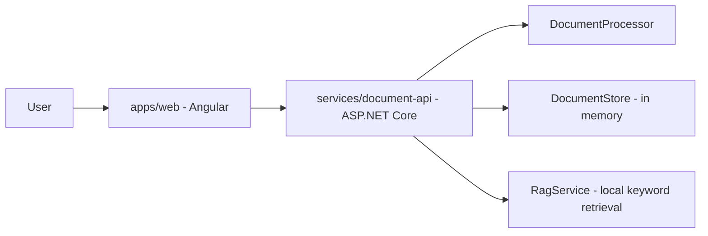

# Architecture

My Brain is organized as a small microservice-ready monorepo.

## Services

| Path | Responsibility |
| --- | --- |
| `apps/web` | Angular client for upload, document selection, and chat. |
| `services/document-api` | ASP.NET Core API responsible for document ingestion, text extraction, chunking, retrieval, and answer generation. |
| `infra/docker` | Docker Compose variants and deployment-oriented infrastructure files. |
| `docs` | Architecture and operational documentation. |

## Current Runtime

## Production Evolution

The current backend is intentionally modular so the MVP can evolve without collapsing into a single large service. Suggested next services:

- `services/identity-api`: authentication, users, organizations, and JWT/session management.
- `services/ingestion-worker`: background PDF extraction, OCR, chunking, and retry handling.
- `services/rag-api`: embeddings, vector search, prompt assembly, and LLM orchestration.
- `services/storage-api`: file metadata, object storage integration, and signed upload URLs.

Recommended infrastructure upgrades:

- PostgreSQL for document metadata and users.
- Object storage such as S3, Azure Blob Storage, or Cloudflare R2 for uploaded files.
- Vector search through pgvector, Qdrant, Pinecone, or Azure AI Search.
- Queue-based processing with RabbitMQ, Azure Service Bus, SQS, or Hangfire.
